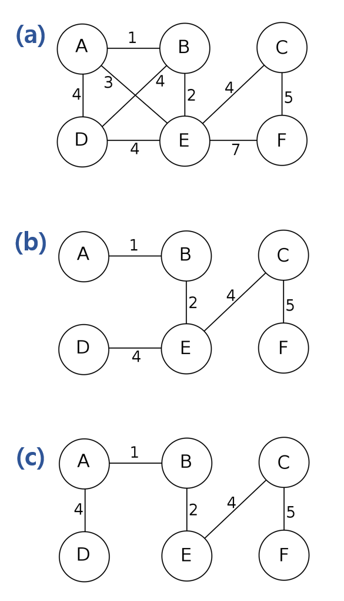
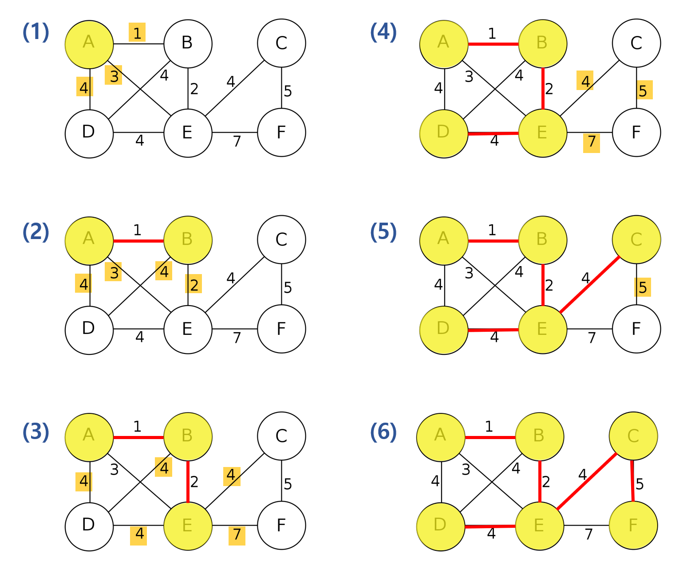

# Graph

## Minimum Spanning Tree

### Spanning Tree

- **최소 연결 부분 그래프**로 일부의 엣지를 선택해서 만든 트리이다
  - 최소 연결 : 엣지의 수가 가장 적다. 

- 모든 노드를 포함해야 하며 모든 노드가 서로 연결 되어야한다. 
- Tree의 속성을 만족하는 그래프
  - 사이클을 포함해서는 안된다. ( [Tree 의 속성](https://ratsgo.github.io/data structure&algorithm/2017/10/21/tree/) )
- n개의 노드일 때, n-1개의 엣지를 가진다.
- 사용 사례 : 통신 네트워크 구축    

### Minimum Spanning Tree (최소 신장 트리)

- Spanning Tree 중 엣지의 가중치의 합이 최소인 신장 트리
  - 
    - 그림의 (b)와 (c)모두 (a) 그래프의 minimum spanning tree
- MST는 여러개가 될 수 있다.
- MST를 찾는 알고리즘 : Kruskal 알고리즘 , Prim 알고리즘

### Prim Algorithm

- 시작 노드를 기준으로 가장 작은 엣지와 연결된 노드를 선택하여 신장 트리를 확장시키는 알고리즘

- 노드 선택 기반 알고리즘

- 과정

  - 시작 노드 선택 
  - 앞 단계에서 만들어진 MST 집합에서 인접한 정점들 중 최소 간선으로 연결된 정점을 선택하여 트리 확장
  - 트리가 N-1개의 엣지를 가질 때까지 반복

  

- Time Complexity : O(ElogV)

#### 코드

- https://m.blog.naver.com/PostView.nhn?blogId=ssarang8649&logNo=220992988177&proxyReferer=https:%2F%2Fwww.google.com%2F
-  https://imnotabear.tistory.com/112 

### 추가 자료

- [Prim 알고리즘- 우선 순위 큐](https://victorydntmd.tistory.com/102)
- [백준 문제](https://www.acmicpc.net/problem/1197)

#### Reference

-   https://en.wikipedia.org/wiki/Minimum_spanning_tree 
-   https://gmlwjd9405.github.io/2018/08/28/algorithm-mst.html 
-   https://gmlwjd9405.github.io/2018/08/30/algorithm-prim-mst.html 
-   [https://ratsgo.github.io/data%20structure&algorithm/2017/11/28/MST/](https://ratsgo.github.io/data structure&algorithm/2017/11/28/MST/) 
-   [https://velog.io/@fldfls/%EC%B5%9C%EC%86%8C-%EC%8B%A0%EC%9E%A5-%ED%8A%B8%EB%A6%AC-MST-%ED%81%AC%EB%A3%A8%EC%8A%A4%EC%B9%BC-%ED%94%84%EB%A6%BC-%EC%95%8C%EA%B3%A0%EB%A6%AC%EC%A6%98](https://velog.io/@fldfls/최소-신장-트리-MST-크루스칼-프림-알고리즘) 

