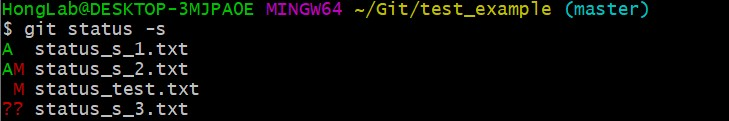

# Git Basic

- Git Bash 사용
## git 설치 및 버전 확인
1. [Git 설치](https://git-scm.com/)
2. 버전 확인  
`$ git --version`

## 환경 설정
처음에 1회 실행
- `$ git config --global user.name "이름"` 이름 등록
- `$ git config --global user.email "이메일@이메일"` 이메일 등록  
- `$ git config --list` 설정 확인

## Git과 Github 원격 저장소에 연동

- `$ mkdir [file명]` 폴더 생성
- `$ cd [폴더명]` 폴더로 이동
- `$ git init` 현재 폴더를 git 로컬 저장소로 등록 , (master)가 나타난다.
- `$ git add [폴더명 혹은 파일명]` git add . 은 현재 폴더의 모든 파일
- `$ git commit -m "commit message"` commit message를 기록 하며 commit하기
- `$ git remote` 연결 된 저장소가 있음 이름이 나오고 없으면 아무것도 안나온다.
- git hub에서 new repository 생성
- `$ git remote [단축 이름] [URL]` URL에 github repository 주소 입력하면 연결
- `$ git push origin master` 데이터 전송 창이 뜨면서 github에 잘 올라감 (로그인 창이 뜨기도)

## .ignore로 git에서 제외시키기
.ignore파일 열어서 원하는 파일 입력 ,  * 과 같은 것으로 확장자 및 공통된 파일들을 ignore 대상으로 넣을 수 있다. Ex) *.pdf
- `$ vim .ignore`
- `$ git add .`
- `$ git status` git 상태 확인 – ignore 에 넣은 파일은 제외 됨을 알 수 있음
- `$ git commit -m "testing ignore"`
- `$ git push origin master` github에 push

## git clone
- `$ git clone [원격 저장소]` github에서 주소를 받아와서 clone하기

## git pull 
- `$ git pull origin master` origin의 내용이 master로 복사

## git clone, pull, fetch 차이
* **git clone**
  - 원격에서는 소스를 수정할 수 없으므로 이 저장소로 작업할 로컬에 내려 받는 과정, 새로운 프로젝트 투입 상황
* **git pull**
  - github에 있는 파일들을 local로 가지고 오지만 pull은 local repository에 저장(add)되며 현재 local repository와 비교
  - git pull = git fetch + git merge
* **git fetch**
  - local에 연결된 remote repository를 업데이트 하는 명령어
  
  
 ## 파일의 세가지 상태와 세가지 단계
 ### 상태
 - **Committed** : 데이터가 로컬 데이터베이스에 안전하게 저장됨
 - **Modified** : 수정한 파일을 아직 로컬 데이터베이스에 커밋하지 않음
 - **Staged** : 현재 수정한 파일을 곧 커밋할 예정
 
 ### 단계
 - **Working Directory** : **Working directory**에서 파일 수정
 - **Staging Area** : **Staging area**에 파일을 stage 해서 커밋할 스냅샷을 만듦.
 - **.git directory (repository)** : Staging Area에 있는 파일들을 커밋해서 **Git directory**에 영구적인 스냅샷으로 저장
 
 ## git status : 수정하고 저장소에 저장하기
 워킹 디렉토리의 파일들은 Tracked/Untracked 로 나뉜다. Tracked는 관리 대상으로 이미 스냅샷에 포함한 파일을 의미하고 Unmodified, Modified, Staged중 하나의 상태로 나타난다. 그 외 나머지는 Untracked 파일이라고 지칭한다. 
  - **Untracked** : 관리 대상이 아님.
  - **Unmodified** : 수정되지 않은 상태
  - **Modified** : 수정된 상태
  - **Staged** : 커밋으로 저장소에 기록할 상태  
  
- `cd [깃 경로]` .git 저장소 경로로 이동
- `git status` 파일의 상태 확인하기, 아무것도 안 하면 clean으로 뜸 , -s 옵션은 짧게 보여주기.
- `touch [파일 명]` 파일명 파일 만들기
- `git status` 새로 만든 파일이 untracked file로 올라가 있음. 
- `git add [파일명]` git add 명령어로 파일 새로 추적
- `git status` 새로 만든 파일이 tracked되어 commit 되길 기다리고 있음. 
- `git commit -m “메시지”`
- `git status` commit을 완료한 상태로 clean , 로컬에 저장됨. 
- `git push origin master` git hub에 올리기 (origin repository 연결 되어있음)

- `git status -s` or `git status --short` status를 짤막하게 보여줌
### 실습

- ??: untracked 파일
- M: modified file
- A: add한 파일 
- status_s_1.txt는 새로 생성 후 add 한 파일
- status_s_2.txt는 새로 생성 후 add 하고 나서 수정한 파일
- status_test.txt는 전에 있던 파일 수정.
- status_s_3.txt는 새로 생성 후 add하지 않은 파일  

## git commit
- `git commit` staging area에 있는 파일 저장
- `git commit -m "message"` message를 통해 commit하는 내용 저장 (주로 많이 사용)
- `git commit -a -m “staging area 생략”` taging area에 올리는 add 작업하지 않고 실행 

## git rm
git rm 명령어로 파일을 제거

### 파일 삭제하기
**rm 명령어**
- `rm [파일명]` 파일을 로컬에서 지우기. 하지만 staged가 되지 않기 때문에 add 해야함.
- `git add .` 
- `git status` 파일 지운 것이 staged되었으므로 git에서 삭제
- `git commit -m "메세지"` 파일 삭제 반영

**git rm 명령어**  
위 rm 하고 add하는 과정을 git rm으로 해결  
- `git rm [파일명]` 파일을 지우고 지운 파일을 staged area로 올림
- `git commit -m "message"` 파일 삭제 반영
파일 명을 패턴을 사용하여 파일이나 디렉토리를 한번에 삭제 가능

### staging area 에서 파일 삭제하기
local에서는 지우지 않고 staged 상태인 파일을 staging area에서 삭제하고 싶다면 --cached 옵션 사용하기
- `git rm --cached [파일 명]`
- `git add .`
- `git commit -m "message"`

## git diff
- 기존 파일을 수정 한 뒤
- `git diff` 수정했지만 아직 add를 하지 않아 staged가 아닌 파일을 보여줌.
- 파일 수정 후 `git add . `을 한 후
- `git diff --staged` 수정 후 staged인 상태
- `git diff --cached` staged인 상태 파악

## git log
git log를 통해 최근 커밋부터 시간순으로 원하는 히스토리를 볼 수 있다. 여러 옵션을 가지고 원하는 히스토리를 볼 수 있다. 
- `git log` 가장 최근의 커밋 나옴
- `git log -p` 각 커밋의 diff 결과를 보여줌
- `git log -2` 최근 두개의 결과 보여줌

## 파일 상태를 unstage로 변경
git add 후 git status를 하면 unstage하기 위한 명령어에 대한 설명이 나옴.
- `git add .` 모든 파일 add
- `git status` 현재 상태 보여줌, staged된 부분들이 있음
- `git reset HEAD [file명]` staged된 file을 unstaged로 변경

## modified로 파일 되돌리기
수정된 파일을 다시 되돌리기 위해서 사용. 하지만 원래 파일로 덮어쓰는 것이므로 위험한 부분으로 잘 사용하지 말 것
- 파일을 수정 후
- `git status` modified된 파일을 나타냄
- `git checkout [파일명]` 파일이 다시 되돌아감

## Tag

### git tag 종류 (2가지)
- **Lightweight** : branch와 비슷한 개념으로 특정 commit에 대한 포인터로 commit 체크섬을 저장하는 것  
- **Annotated** : Git DB에 태그 생성자, 이메일, 태그 생성 날짜, 태그 메시지를 저장.  
단순한 태그를 사용한다면 Lightweight를 사용한다. lightweight 같은 경우 그냥 commit 정보를 보여준다면 annotated는 tagger, date 등 태그 정보도 보여준다.  

- `git tag` 이미 만들어진 태그 조회 , -l “검색패턴” 옵션을 사용하여 태그 검색 가능
- `git tag -a [태그이름] -m "메시지"` **annotated** 태그 만들기
- `git tag` 생성된 태그를 볼 수 있다.
- `git tag [태그이름]` **lightweight** 태그 만들기, 옵션을 사용하지 않는다.
- `git show [태그이름]` 태그 이름에 대한 정보를 알려준다.  

### 나중에 태그하기
예전 커밋에 관한 태그 하기 위해사용  
- `git tag -a [태그명] [커밋 체크섬]` 

### 태그 공유하기
git push 명령어는 자동으로 리모트 서버에 태그를 전송하지 않는다. 태그를 만들면 따로 서버에 별도로 Push해야한다.  
- `git push origin master` 일반적으로 commit한 것을 remote저장소에 올리기
- `git push origin [태그명]` 태그를 만들어 remote저장소에 올리기
- `git push origin --tags` 태그 여러 개를 한번에 올린다.   

#### 태그 체크아웃
브랜치와 달리 가리키는 커밋을 바꿀 수 없기 때문에 checkout을 할 수 없다. 그래서 새로 브랜치를 생성하고 업데이트를 하는 방식으로 해야한다.

## Github : fork
fork는 다른 원격 저장소에 있는 히스토리를 그대로 나의 GitHub원격 저장소에 복사하는 것
- fork할 repository를 선정해 “Fork” 버튼 누르기
- git clone을 통해 fork한 프로젝트 local에 가져오기 (clone을 하면 remote저장소에 자동연결)
- 작업 후 add, commit, push
- 기존 fork를 한 프로젝트에 변경내용을 파악하고 반영하기 위해 remote저장소에 추가하기 
  - 주로 upstream으로 추가 
  - `git remote -v` 원격저장소 현황 확인
- pull을 통해 원래 저장소의 변경된 사항 반영
  - Fork한 저장소의 변경사항을 나의 local에 반영하기 위함 (pull = fetch + merge)
  - 혹은 fetch와 merge를 통해서 작업 
- push를 통해 자신의 local에서 작업한 내용을 내가 fork한 나의 repository에 올리기
- pull request를 통해 원래의 repository(fork해온 repository)에 합친다.
  - GitHub에 저장소를 보면 push를 하고 나서 “Compare & pull request” 버튼이 활성화가 된다. 이 버튼을 통해서 message 작성 후 PR(Pull Request)를 보낸다. 
- PR을 받은 원본 저장소 관리자는 코드 변경 내용을 확인 하고 Merge 결정

## Github : private and collaborator

### Github private 
git hub는 개인 계정에서 private을 무료로 제공하기 시작함. 단, 3명의 collaborator만 가질 수 있다. (2019.10 기준)

### Github collaborator
- repository의 setting에 들어가면 collaborator 추가 가능
- collaborator를 추가하면 이메일이 가고 그 링크(invitation)를 타고 들어가야 invite가 accept됨.
- collaborator가 my repositories 리스트로 보고 싶으면 fork를 해야함. 

